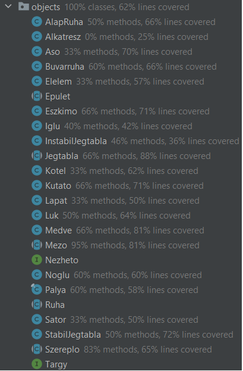

# Egységtesztek
A tesztek alapja az volt, hogy készítettünk az alkalmazásnak megfelelő formátumú pályát, amelyen bizonyos viselkedéseket értünk el.

Az alábbi tesztesetekre koncentráltunk:
- Tesztpályák készítése
- Iglu megvéd a medvétől
- Sikeres lépés
- Lapát sikeres használata
- Kutató sikeres felderítés
- Kutató sikertelen felderítés (nem szomszédos mező)
- Tesztpálya sikeres felépítése (megfelelő szomszédok, teherbírás stb.)
- Sátor lerombolódik egy kör után
- Épület megvéd a hóeséstől
- Sikertelen tárgy felvétel (hó alatt van)
- Eszkimó sikertelenül épít (nincs felderítve)
- Lyukba esésnél felderítődik a mező

## Tanulság
A felhasználói felülettel való túlzott függés miatt problémába ütköztünk a mockolás alatt, így kénytelenek voltunk olyan teszteseteket írni, amelyekhez az alkalmazás futtatásáért felelős osztályra nem volt szükségünk. Ennek megoldására az objektumorientált tervezési elvek között szereplő laza csatolás elvet kéne alkalmazni az alkalmazás fejlesztése során, amelynek köszönhetően az üzleti logika és a megjelenítési réteg jobban elkülönül egymástól.

Továbbá a játék során fellépő nem determinisztikus események miatt törtek el a tesztek (pl. medve véletlenszerűen lép és szereplővel végzett), így ennek megoldására előre meghatározott cselekvésekkel váltottuk fel ezeket a random eseményeket.

## Összegzés
A tesztek során arra törekedtünk, hogy komplexebb, több lépésből álló, játék alatt előforduló forgatókönyveket implementáljunk.
Ez abban jelentkezett, hogy minden egyes teszt előtt egy adott pályát betöltöttünk és ezen végeztük a vizsgálatokat.
Ezen felül a játékban lévő tárgyak, mezők (kötél, ásó, instabil jégtábla stb.) főbb funkcióit leteszteljük, ezzel elérve egy bizonyos kódlefedettséget.
A tesztek sikeresen lefutottak és a funkciók helyesen működtek.
