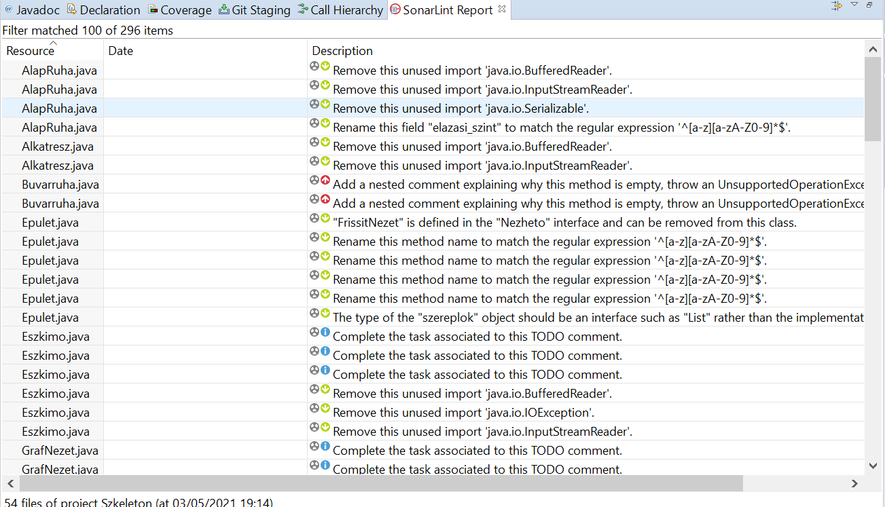
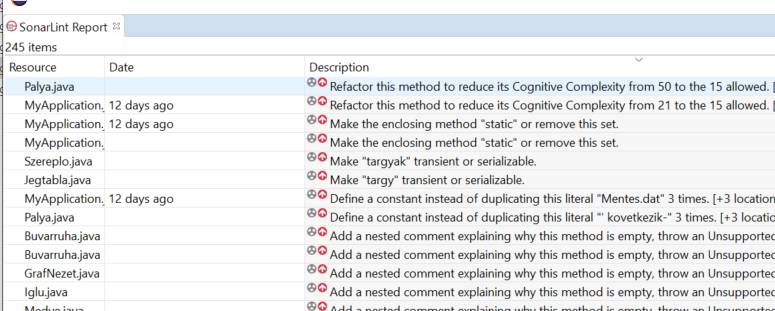

# Statikus analízis és javítás

Eclipse fejlesztői környzetben futtattam a SonarLint statikus ellenőrző programot.
Rengeteg, összesen 296 hibát talált a program:

Ezek közül néhány súlyosabb, piros jelzésű hibát sikerült is kijavítani:
- IOStream műveletek javítása
- Random megfelelő használata
- Nem használt függvényparaméterek eltávolítása
- Általánosítás, ArrayList helyett csak List interface
- Absztrakt ős osztályok konstruktora protected

Így a jelzések száma is 245-re csökkent:

## Összegzés

A feladat során kiderült, hogy milyen hatalmas segítséget nyújtanak a statikus ellenőrzést végző programok, jelen esetben a SonarLint. Mivel a figyelmeztetések a hibák súlyosságára is utalnak ezért ez alapján is lehet mérlegelni, hogy melyik hiba kritikus, melyik hiba kijavítására fordítsuk az erőforrásainkat.
